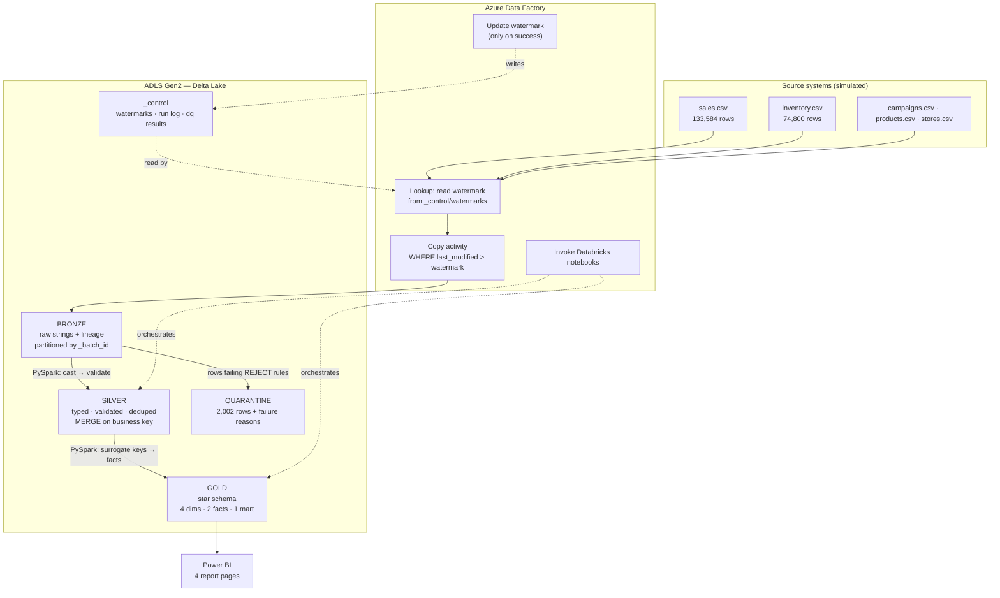

# ARCHITECTURE

## 1. The problem this shape solves

A retailer runs promotions and wants to know which ones paid back. Answering
that needs three feeds that arrive separately and disagree with each other:
point-of-sale transactions, weekly stock snapshots, and a campaign master. The
analyst's version of this job is to export three CSVs, clean them by hand in
Excel, join them on product and store codes, and rebuild the whole thing next
month.

That manual workflow fails in four specific ways, and every architectural choice
below is a response to one of them:

| Failure | Response |
|---|---|
| Cleaning is redone every time, differently | Clean **once**, in Silver, with declarative rules |
| Reprocessing everything is slow and gets slower | **Incremental** loads driven by a watermark |
| Corrections create duplicates or get missed | **MERGE** on a business key |
| Joins on string codes across three files are slow and error-prone | **Star schema** with integer surrogate keys |

---

## 2. Component responsibilities

The boundary that matters most: **ADF orchestrates and moves; Databricks
transforms.** Keeping transformation logic out of ADF means it is testable in
Python, reviewable as code, and runnable locally without an Azure bill.

| Component | Owns | Explicitly does NOT own |
|---|---|---|
| **Azure Data Factory** | Scheduling, the watermark lookup, the Copy activity, invoking Databricks, retry/failure signalling | Any business logic, cleaning, joins, aggregation |
| **ADLS Gen2** | Durable storage of all three layers, hierarchical namespace | Compute, query serving |
| **Azure Databricks** | Spark compute for Silver and Gold | Scheduling, source connectivity |
| **PySpark** | Validation, deduplication, MERGE, dimensional modelling, KPIs | Presentation |
| **Delta Lake** | ACID transactions, schema enforcement, MERGE, time travel, file compaction | — |
| **Power BI** | Semantic model, measures, visuals | Data cleaning, business-key resolution |

---

## 3. Data flow



---

## 4. Bronze — preserve, don't interpret

**Everything lands as STRING.** This is the choice people most often question,
so the reasoning matters:

A cast that fails during ingestion destroys evidence. `"N/A"` cast to INT is
just `NULL`, and once it is NULL nobody can tell whether the source sent `"N/A"`,
an empty string, a genuine null, or whether the ingestion itself broke. Keeping
the raw text means Silver can report exactly what arrived and quarantine it with
the original value attached — which is what makes
[DATA_QUALITY.md](DATA_QUALITY.md) verifiable rather than anecdotal.

The second reason is reprocessing. When a Silver rule turns out to be wrong,
Bronze is rebuilt from — nothing. Silver is rebuilt from Bronze. The source
system, in a real estate, may have already overwritten the row.

**Layout**

```
bronze/
  sales/_batch_id=batch_01_initial/...
  inventory/  campaigns/  products/  stores/
```

Partitioned by `_batch_id` so a re-run replaces its own partition via
`replaceWhere` rather than appending a second copy.

**Lineage columns added to every row:** `_ingest_run_id`, `_ingest_timestamp`,
`_source_file`, `_source_system`, `_batch_id`.

**What Bronze does not do:** cast, clean, deduplicate, join, or apply a single
business rule.

---

## 5. Silver — make it trustworthy

The fixed order, from `src/silver/build_silver.py`:

```
read Bronze above the Silver watermark
  → try_cast to real types            (failures become NULL, not exceptions)
  → resolve referential integrity     (broadcast joins to the masters)
  → evaluate every rule               (one boolean column per rule)
  → split: REJECT failures → quarantine
  → apply REPAIR substitutions        (unresolvable campaign → Unknown)
  → deduplicate on the business key   (newest last_modified wins)
  → MERGE into the Silver Delta table
  → write per-rule DQ counts
  → advance the watermark             (only now)
```

Two ordering decisions carry real weight:

**Deduplicate before the MERGE.** Delta's MERGE raises an error if one target
row matches multiple source rows — it cannot choose which version wins. The
source deliberately re-sends transactions, so a batch legitimately contains the
same `transaction_id` twice. Collapsing to one row per business key first is
what makes the MERGE deterministic instead of a runtime failure.

**Advance the watermark last.** If the write fails, the watermark stays put and
the next run re-reads the same window. Re-reading is safe precisely because
every downstream write is a MERGE on a business key, so replay converges to the
same result rather than duplicating.

---

## 6. Gold — model it for questions

Star schema. One fact surrounded by conformed dimensions, joined on integer
surrogate keys.

```
        dim_date ────┐
                     │
      dim_product ───┼──▶  fact_sales  ◀─── dim_campaign
                     │      (130,023)
        dim_store ───┘          │
              │                 │
              └──▶ fact_inventory_snapshot (74,800)
                        ▲
                   dim_date, dim_product

        dim_campaign ──▶ mart_campaign_roi (36)
```

### Grain — stated explicitly, because everything follows from it

| Table | Grain | Primary key |
|---|---|---|
| `fact_sales` | One sales transaction: one product, one store, one moment | `transaction_id` (degenerate dimension) |
| `fact_inventory_snapshot` | One product, one store, one weekly snapshot date | `(date_key, product_key, store_key)` |

`fact_inventory_snapshot` is a **periodic snapshot** fact and its measure is
**semi-additive**: stock may be summed across products and stores, but never
across dates. Summing four weekly snapshots of 1,000 units would claim 4,000
units that never existed — the same physical units counted once per week. The
DAX measures in `powerbi/measures.dax` average across dates for this reason.

### Special dimension members

Every dimension carries an **Unknown** member (key `-1`); `dim_campaign` also
carries **No Campaign** (key `0`).

This is what lets `fact_sales` be joined with an INNER join and lose nothing. A
sale whose campaign id cannot be resolved points at Unknown rather than at NULL.
NULL foreign keys silently disappear from inner-joined reports — exactly the
kind of quiet undercount that destroys trust in a dashboard.

Keeping `0` and `-1` distinct matters too: *"this sale was not promoted"* and
*"we don't know whether it was promoted"* are different answers, and collapsing
them would inflate the baseline that promotion ROI is measured against.

### Why surrogate keys

Integer joins beat repeated string comparisons, and a surrogate insulates the
model from a source system renumbering its natural keys. Keys are assigned once
on first insert and never reissued — a MERGE updates a dimension row's
attributes but leaves its key alone, so previously loaded facts keep pointing at
the right row.

### Physical layout

`fact_sales` is partitioned by `year_month` — four partitions of ~33K rows.
Partitioning by day would produce 120 files of a few hundred rows each: the
small-file problem, where per-file open cost exceeds what the pruning saves.
`OPTIMIZE ... ZORDER BY (store_key, product_key, campaign_key)` compacts the
files each MERGE leaves behind and co-locates rows on the columns reports filter.

---

## 7. Incremental loading

The watermark column is `last_modified_timestamp` on every feed.

```
read watermark (per layer, per table)
   → SELECT rows WHERE last_modified_timestamp > watermark
   → transform
   → write (MERGE)
   → on success only: watermark = MAX(last_modified_timestamp) seen
```

Each layer keeps its **own** watermark. Bronze's watermark tracks what has been
extracted from the source; Silver's tracks what has been curated from Bronze;
Gold's tracks what has reached the star schema. Decoupling them means Silver can
be rebuilt from Bronze without re-extracting from the source.

**Late-arriving corrections are the case this exists for.** About 1.5% of
transactions are amended days after the sale and arrive in a later batch
carrying their *original* transaction date. A naive "load yesterday's date
partition" job misses them entirely. A watermark on `last_modified_timestamp`
catches them, and the MERGE updates the row in place.

Measured across the three batches: **405 rows updated** by MERGE, **1,752 rows
correctly filtered out** by the watermark in batch 3 (a deliberate re-send of
part of batch 2).

**This is not CDC.** There is no change-data-capture feed, no log reader, and no
tracking of deletes. A row deleted in the source would remain in the Lakehouse.
The honest description is *timestamp-based incremental extraction*.

---

## 8. Failure points and behaviour

The distinction that matters: a **data** failure must not look like a
**pipeline** failure, and vice versa.

| Failure | Detected by | Behaviour |
|---|---|---|
| Source file missing | Spark read | Job fails loudly. Watermark unmoved; safe to retry |
| **Column missing/renamed** | `validate_structure()` | Raises `SchemaValidationError` — **fails the run**. A broken contract has no sensible partial result |
| Bad value in a row | Row rules | Row quarantined with reasons; **run continues** |
| Unresolvable campaign id | `SAL_014` (REPAIR) | Routed to Unknown member; revenue still counted |
| Duplicate transaction | Dedup on business key | Newest version kept; count recorded |
| Late correction | MERGE + `last_modified` guard | Updates in place |
| Stale replay of an old batch | `s.last_modified > t.last_modified` | Ignored — cannot revert a newer correction |
| Transformation crash | Exception | Watermark unmoved; next run re-reads the same window |
| Duplicate execution | Watermark + `replaceWhere` + MERGE | No-op. **Verified**: `metrics/idempotency_check.json` |

### What happens if the pipeline runs twice?

Nothing changes. Verified by replaying an already-processed batch and comparing
every curated table before and after — zero rows and zero revenue changed. Three
independent mechanisms produce this, and the check would fail if any were
missing:

1. The watermark returns zero rows for an already-processed window.
2. Bronze's `replaceWhere` replaces a batch partition rather than appending.
3. Silver and Gold MERGE on business keys, so a re-presented row updates.

---

## 9. Security

Proportional to a mini-project, and honest about it:

- **No credentials anywhere in code.** No keys, tokens or connection strings are
  committed; `.gitignore` excludes `.env`, `*.key`, `config/secrets*`.
- **Identity-based ADLS access.** Databricks accesses storage through its
  managed identity / access connector with the *Storage Blob Data Contributor*
  role, rather than a shared account key. A leaked account key cannot be scoped
  or revoked per-workload; a role assignment can.
- **Least privilege in practice:** the identity is granted access to the one
  container it needs, not the subscription.
- **Not implemented** (and out of scope): Unity Catalog governance, column-level
  masking, private endpoints, customer-managed keys, network isolation.

---

## 10. Cost

The whole design is shaped by keeping the Azure bill near zero:

- **Local-first.** Data generation, all transformation logic, the entire test
  suite, the quality checks and the benchmark run on a laptop against a local
  Delta lakehouse. Azure is used to *demonstrate* the architecture, not to
  develop it.
- **Smallest viable Databricks cluster**, single node, with aggressive
  auto-termination. Compute is the dominant cost and it is off by default.
- **ADF triggers disabled** — pipelines are run manually. There is no schedule
  burning activity runs.
- **ADLS Standard, LRS, Hot.** Total data footprint is well under 1 GB.
- **Power BI Desktop only** — no Premium capacity, no Fabric.
- Teardown is documented in [AZURE_CLEANUP.md](AZURE_CLEANUP.md).

---

## 11. How this would scale

The dataset is 130K rows; the architecture is the same at 130M. What changes:

| Concern | At 130K (now) | At 100M+ |
|---|---|---|
| Shuffle partitions | 8 (200 would create tiny files) | Tune to ~128 MB per partition |
| Fact partitioning | `year_month`, 4 partitions | Daily partitions, plus liquid clustering |
| Broadcast joins | All dimensions broadcast (KB-sized) | Still broadcast — dimensions stay small; that is the point of a star schema |
| Bronze | Single Delta write per batch | Auto Loader for incremental file discovery |
| Dedup window | Full batch | Bounded look-back window; unbounded state does not scale |
| Cluster | Single node | Multi-node autoscaling |
| OPTIMIZE | After every run | Scheduled, with `VACUUM` retention policy |

What does **not** change: the medallion boundaries, the watermark pattern, the
MERGE-on-business-key contract, and the star schema. Those are the parts worth
learning.
